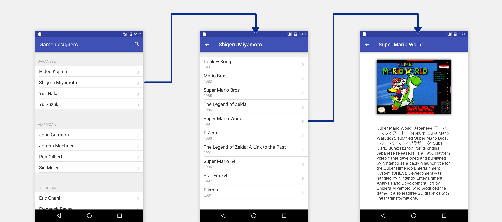
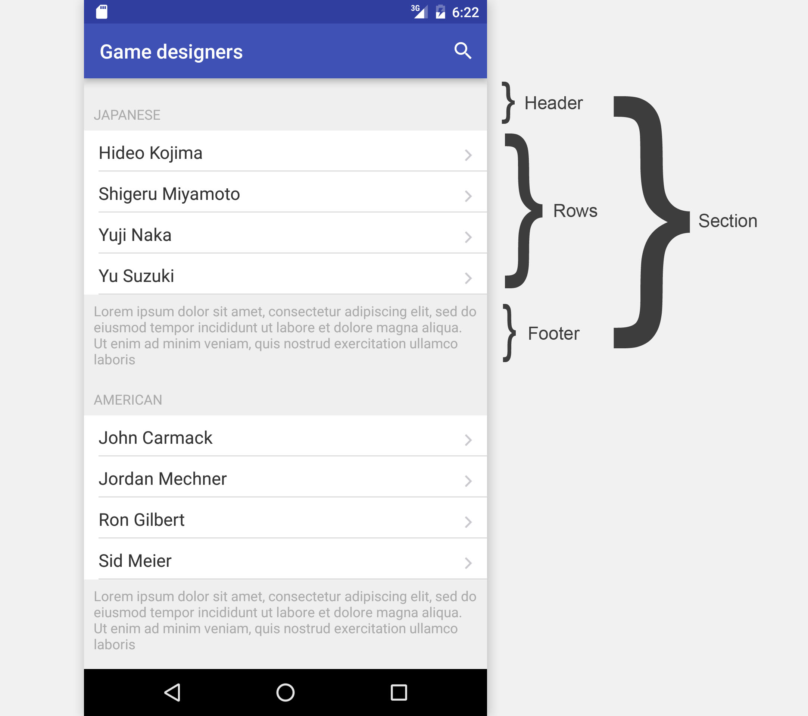
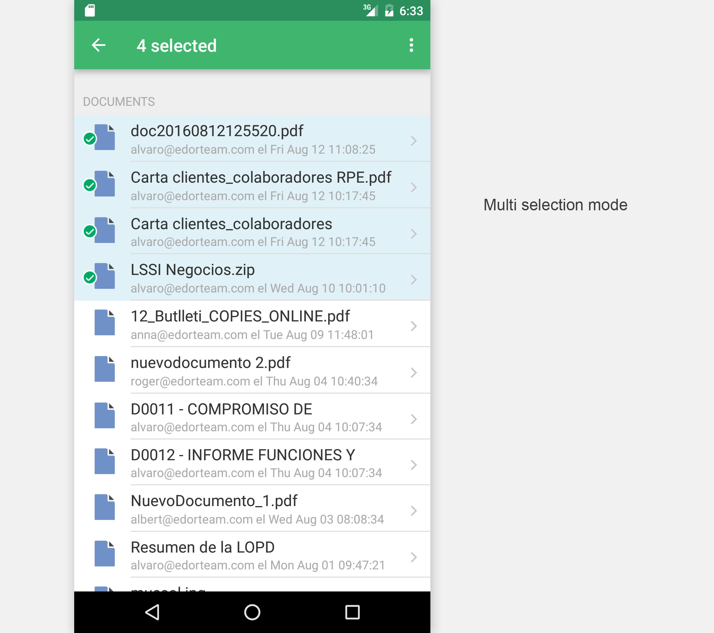
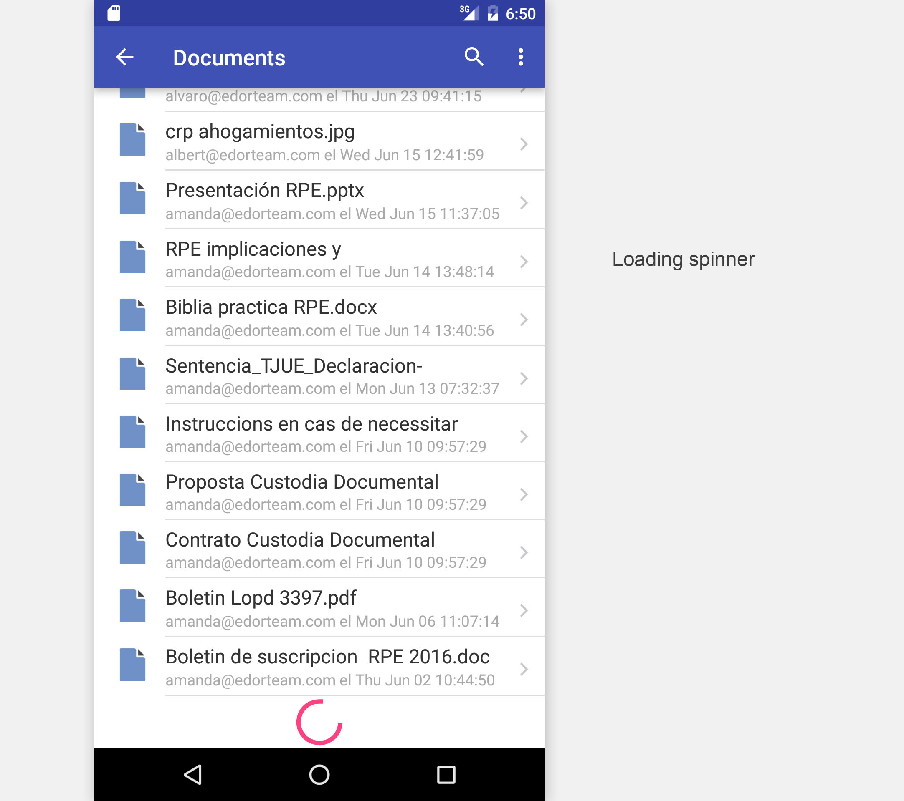
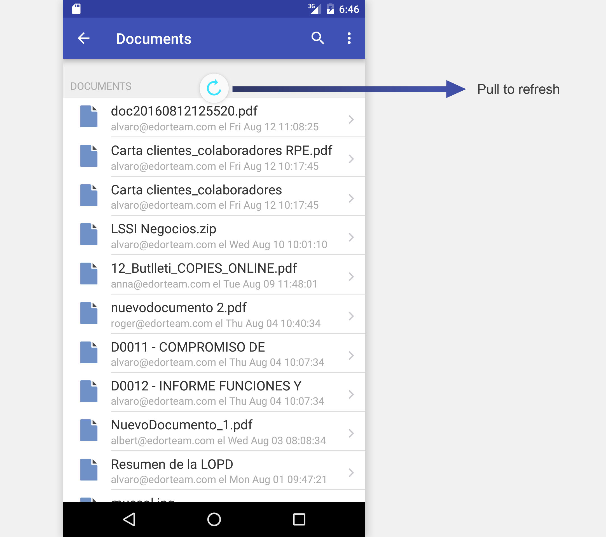
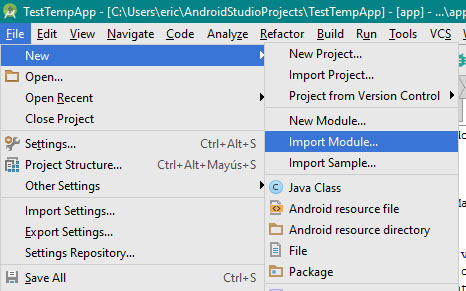

#Android Basic Framework
**Author:** Eric Alarcón Cochin
[eric@edorteam.com](mailto:eric@edorteam.com)

**Version:**  0.7
**Publishing date:** August 29, 2016


---
#Introduction

> BasicFramework is a set of tools that helps you build simple Android applications faster.


It contains three basic tools:

- **NavigationActivity**: manages the navigation of hierarchical content (similarly to Apple's UINAvigationViewController) and the ActionBar menus for the current view.
- **ListFragment**: contains a flexible ListView with sections and a multi-select mode.
- **TabsFragment**: manages a tab-style selection interface.

Let's see it with more detail:
<div style="page-break-after:always;"></div>

## 1. NavigationActivity

<center>*NavigationActivity in phones* </center> 


<center> *NavigationActivity in tablets (combined with TabsFragment)*</center> 

The NavigationActivity class implements a specialized Activity that manages the navigation of hierarchical content. A NavigationActivity object manages the currently displayed screens using the navigation stack, which is represented by an array of Fragments. The first Fragment in the array is the root Fragment. The last Fragment in the array is the Fragment currently being displayed. You add and remove Fragments from the stack using the methods of this class. It must be subclassed to implement abstract methods.


The NavigationActivity class handles:

- Pushing/popping fragments
- The animation between fragments
- Displaying a master-detail layout in tablets (optional) automatically, with the same code.
- Changing the ActionBar title dynamically
- Changing the ActionBar menus dynamically
- Changing the ActionBar menu to "multi selection mode" (with different color and a specific menu)
- The back button behaviour

<div style="page-break-after:always;"></div>

## 2. ListFragment

|  |   |
|--------|--------|
|        |        |
 
    


ListFragment is a Fragment that contains a ListView with the following features:

- Divides the list in sections. A section is a set of rows with a header and a footer
- Provides multi selection mode on long press
- Shows loading spinner at the bottom
- Provides "pull to refresh" mechanism
- Can display different types of rows in the same list (some provided with the framework, but you can also make your own)


*Note: in fact, the magic happens in the UniversalRowAdapter class. We will see more of that later, but this means you can implement this in any ListView, you just have to attach the UniversalRowAdapter to your ListView. The ListFragment just simplifies the process.*


<div style="page-break-after:always;"></div>

## 3. TabsFragment


The TabsFragment class implements a specialized Fragment that manages a tab-style selection interface. This tab bar interface displays tabs at the top of the window for selecting between different Fragments. It must be subclassed to implement abstract methods.

The TabsFragment handles:

- Setting the tab bar's titles and icons
- Displaying a Fragment for each tab


<div style="page-break-after:always;"></div>
#How to use it

## 1. Getting started & setup environment
1. Download the example project.
2. Open your existing project or create a new one (by clicking "File - New Project - Empty Activity").
3. Add the Module in your existing project. In Android Studio this is done by selecting "File - New - Import Module..."


4. Set the Source directory to the "basicframework" folder inside the example project you just downloaded, and click "Finish" (the entire folder will be copied to your project, so you don't need to move it)


5.  Add the BasicFramework dependency to your App. To do so:
	- Click "File - Project Structure".
	- Select your App module in the left, select the tab "Dependencies".
	- click the "+" button and select "Module dependency".
    - Select the ":basicFramework" dependency and click OK.
	 

6. To support device rotation: Edit your App's AndroidManifest.xml file and, in all the `<activity>` tags, add the `android:configChanges` attribute: 
```xml
<activity android:name=".YourMainActivity"
            android:configChanges="orientation|keyboardHidden|screenSize">
```
*If you add an another activity later, you must come here and add the attribute*

6. To support tablet layout: Edit your style.xml file located in res/values and, inside the `<style>` tag, add: 
```xml
<item name="windowActionBar">false</item>
<item name="windowNoTitle">true</item>
<item name="android:actionMenuTextColor">#fff</item><!--replace color-->
<item name="android:textColorSecondary">#fff</item><!--replace color-->
```
*Even if you don't want to support tablet interface, this setting is recommended to avoid warnings in the Framework*
4. **You are ready to go!**

<div style="page-break-after:always;"></div>
##2. Using NavigationActivity
Keep in mind that **every Activity in your app** should extend NavigationActivity, because even though you don't plan to perform navigation, it will provide you the ActionBar menus and a back button to go back to the previous Activity (if necessary). This way your app will have a consistent interface.

How to use it:
- Add a new Java class in your project ("File - New - Java Class"). 
*Note: If you are editing the Activity.java file that provides you the template, delete all its implementations and leave it empty.*
- Make it extend NavigationActivity
- Implement all the NavigationActivity abstract methods (*pro tip: in Android Studio if you click Alt + insert and select implement - methods all the function definitions are automatically generated*)

```java
public class NavigationTest extends NavigationActivity{
    @Override
    public Fragment firstFragment() {
    	//return the first fragment that will be shown
        //jump to the TabsFragment of ListFragment sections
        //of this document to see how to do it
        //(or you can create your own simple Fragment, of course)

    }

    @Override
    public Boolean showBackButtonInFirstFragment() {
    	//show back button already in the first Fragment
        //set to True if this activity is called by another Activity
        //the back button will then pop back to the previous Activity

    }
    
    @Override
    public Boolean showMasterDetailLayoutInTablets() {
    	//set to false if you don't want a master-detail layout in tablets

    }
}
```

###Presenting a new Fragment
You can present a new fragment (with a nice animation) by calling the **pushFragment** method from NavigationActivity.

```java
public void pushFragment(Fragment newFragment, animationType animation, boolean showAsDetailFragmentIfPossible)
```


| Parameter| Type | Description |
|--------|--------|--------|
|**newFragment** |Fragment|New Fragment that will be presented|
|**animation** |animationType| Animation type enum: RIGHT_TO_LEFT, BOTTOM_TO_TOP, FLIP|
|**showAsDetailFragmentIfPossible** |boolean|If set as True, the user is in a Tablet, and you are using a master-detail layout, the Fragment will be shown in the detail Fragment (the panel in the right)|


Since you can access the activity from any Fragment with the getActivity() method, **you can show a new Fragment from the currently displaying Fragment**.
For example you can put this code within a button click listener:

```java
NextFragment f = new NextFragment();
NavigationActivity nav =((NavigationActivity)getActivity());
nav.pushFragment(f,NavigationActivity.animationType.RIGHT_TO_LEFT,false);
```


You don't have to worry about implementing the back button behaviour. This is handled automatically by the NavigationActivity class.

###Setting the ActionBar menu
|  |  |
|--------|--------|
|*ActionBar with one text button*        |   *ActionBar with one icon button*     |

|  |  |
|--------|--------|
|*ActionBar with a search widget and a dropdown with more items*      |   *This is how the search widget looks like when is clicked*    |

You can show a Menu in the ActionBar by calling the `addActionBarMenu` method from NavigationActivity:
```java
public void addActionBarMenu(BFMenu menu)
```
This will add the menu to a stack managed by the NavigationActivity, so when you go back to the previous fragment, it will restore the previous menu.

You may also want to replace the current menu at any time (for example, replace the manu each time a Tab is selected) `replaceActionBar` method from NavigationActivity.
```java
public void replaceActionBarMenu(BFMenu menu)
```

As you can see, in both methods we will need to pass a BFMenu object.
```java
BFMenu menu1 = new BFMenu();
/*
you can optionally pass BFMenuTitleListener parameter to the contstuctor, 
that will be called when an item of the list is selected with the
multi selection mode, so you can set the title as something like "3 items
selected".
*/
```
 
We can perform two operations to a BFMenu object:  **addItem** and **addSearchItem**. The first one will be a button (with icon or text) and the second will be a search widget.

####addItem
To add a button first we need to create a BFMenuItem object:
Function definition:
```java
public BFMenuItem(String pTitle, Integer pIcon, BFMenuItemType pMenuItemType,
BFMenuItemListener aListener)   
```
| Parameter| Type | Description |
|--------|--------|--------|
|pTitle |String|Title of the item|
|pIcon |Integer|(optional) Icon of the item. Set 0 if none. If an icon is set it will be shown as an icon when SHOW_AS_ACTION is set, if not it will be shown as plain text, When SHOW_AS_MENUITEM is set, it will always be shown as plain text.|
|pMenuItemType |BFMenuItemType|SHOW_AS_ACTION is always visible, SHOW_AS_MENUITEM is only visible in the ... popup menu, SHOW_AS_ACTION_IF_ROOM is visible if room|
|aListener |BFMenuItemListener|Handles click action|


Example:
```java
menu1.addItem(new BFMenuItem("Button name", 
							R.mipmap.dummy_file_icon, 
							BFMenuItem.BFMenuItemType.SHOW_AS_MENUITEM, 
							new BFMenuItem.BFMenuItemListener() {
                @Override
                public void onClick() {

                }
}));
```
####addSearchItem
To add a button first we need to create a BFMenuSearchListener object:
Function definition:
```java
public static abstract class BFMenuSearchListener{
        public abstract void onSearchPressed(String query);
        public abstract void onQueryChanged(String query);
        public abstract void onSearchIconClicked();
        public abstract void onSearchIconDismissed();
    }
```

Example:

```java
menu1.addSearchItem(new BFMenu.BFMenuSearchListener() {
                @Override
                public void onSearchPressed(String query) {
					//event triggered when the user press search
                }

                @Override
                public void onQueryChanged(String query) {
					//event triggered when the user edit the text in the searchbox
                }

                @Override
                public void onSearchIconClicked() {
					//event triggered when the user press the search icon
                }

                @Override
                public void onSearchIconDismissed() {
                    //event triggered when the search is cancelled
                }
            });
```


Finally we will just have to call the **addActionBarMenu** method of the NavigationActivity.


<div style="page-break-after:always;"></div>
## 2. Using TabsFragment
- Add a new java class in your project
- Make it extend TabsFragment
- Implement all the TabsFragment abstract methods (pro tip: in Android Studio if you click Alt + insert and select implement - methods all the function definitions are automatically generated)
```java
public class TabTest extends TabsFragment {
    @Override
    public Fragment getTabFragment(int position) {
    	//can be a ListFragment or any Fragment you want

    }

    @Override
    public int getTabCount() {
    	//return the number of tabs

    }

    @Override
    public String getTabTitle(int position) {
    	//return the tab title for each tab

    }

    @Override
    public Integer getTabIcon(int position) {
    	//Return an icon from Resourcer (R.mipmap.) 
        //or null if you don't want an icon

    }

    @Override
    public Integer getTabIconTint(int position) {
    	//return a color for the icon (i.e. Color.WHITE)

    }

    @Override
    public void didSelectTab(TabLayout.Tab tab) {
		//event triggered after a tab is selected
        //here you can change the actionBar if you want
        //with replaceActionBarMenu method from NavigationActivity
    }

    @Override
    public void viewCreated() {
		//event triggered after the view is created
    }
}
```
That's it!


<div style="page-break-after:always;"></div>
##4. Using ListFragment
ListFragment is an abstract class that inflates a layout with a ListView and attach an UniversalRowAdapter to it.

###The UniversalRowAdapter class
You may be wondering: "and what is a UniversalRowAdapter"?
A UniversalRowAdapter is a ListAdapter (obviously) that manages common things that can happen in a ListView, namely:

- Divide the list in sections. A section is a set of rows with a header and a footer
- Multi selection mode on long press
- Show loading spinner at the bottom
- Pull to refresh mechanism
- **Can display different types of rows in the same list** (some provided with the framework, but you can also make your own)

The last point is important. **Even though usually the ListAdapters are created specifically to create a style for your rows**, the UniversalRowAdapter **delegates this work to secondary ListAdapters** so you can use the benefits of the UniversalRowAdapter with any row style. Of course, this framework provides some styles for the rows but you can also create your own, as we will see later.

To use the ListFragment, just add a new class (file - add - new class) and make it extend the ListFragment
```java
import android.content.Context;
import android.widget.ListView;
import com.ericalarcon.basicframework.RowAdapters.UniversalRowAdapter;
import com.ericalarcon.basicframework.Templates.ListFragment;

public class myListFragment extends ListFragment {
    @Override
    public String title() {
    	//return the title of the fragment
        //which will be shown in the ActivityBar

    }

    @Override
    public UniversalRowAdapter getAdapter(Context context, ListView listview) {
    	//MOST IMPORTANT METHOD!
        //Must return a UniversalRowAdapter instance
        //(see example below)

    }

    @Override
    public void onViewCreated() {
		//event triggered after the view is created
    }
}
```

You will have to implement three methods:
```java
public String title()
public UniversalRowAdapter getAdapter(Context context, ListView listview)
public void onViewCreated()
```


###public String title()
You have to return the title that will show in the ActionBar<br/>


###public UniversalRowAdapter getAdapter(Context context, ListView listview)
You have to return a UniversalRowAdapter object, that must implement all the abstract methods:
Function definition:
```java
public UniversalRowAdapter(Context context, Integer size, ListView listview)
```

Example:
```java
return new UniversalRowAdapter(context,10,listview) {
            @Override
            public Integer numberOfSections() {

            }

            @Override
            public Integer numberOfRowsInSection(Integer section) {

            }

            @Override
            public String headerForSection(Integer section) {

            }

            @Override
            public String footerForSection(Integer section) {
            	//return null to show no footer. Return " " if
                //you want to show footer space without text

            }

            @Override
            public Boolean showLoadingSpinnerOnBottom() {

            }

            @Override
            public Boolean startSelectingOnLongClick(SectionIndex index) {
            	//return true if you want to enter to "edit mode"
                //on long press

            }
            
            @Override
            public Boolean pullToRefreshEnabled() {  

            }
            
            @Override
            public ListAdapter listAdapterForItem(Integer position) {
            	//IMPORTANT! see documentation below

            }

            @Override
            public void onListRefresh() {
				//event triggered when list is refreshed
                //(only active if pullToRefreshEnabled returns true)
            }

            @Override
            public void bottomReached() {
				//event triggered when bottom of the list is reached
                //load here more rows and call resetAdapter() method
                //from the adapter
            }

            @Override
            public void onListItemClick(SectionIndex index) {
				//event triggered when a row is pressed
            }

            @Override
            public void onListItemLongClick(SectionIndex index) {
				//event triggered when a row is long-pressed
            }

            @Override
            public void onItemSelected(SectionIndex index) {
				//event triggered when user has entered in
                //edition mode (with a long press) and then
                //selected a row
                //you can activate here the Edit menu like this:
                NavigationActivity nav = (NavigationActivity)getActivity();
				nav.setEditingActionbarMenu(getEditMenu());
            }

            @Override
            public void onItemDeselected(SectionIndex index) {
				//check if the number of items selected is 0 and
                //then remove the Edit menu like this
                NavigationActivity nav = (NavigationActivity)getActivity();
				nav.setEditingActionbarMenu(null);
            }

            @Override
            public void onSelectionModeCancelled() {
				//event triggered when the edition mode
                //(or multi-select mode) is cancelled
                //by deselecting all items o pressing back
            }
        };
```
All the methods that you have to implement are pretty self-descriptive, the more interesting one is ` public ListAdapter listAdapterForItem(Integer position)`. This is where you will have to return a ListAdapter that will render the row. A good place to instantiate the adapters is in the `onViewCreated()` method. This framework provides the following adapters:
- BasicRowAdapter
- DetailRowAdapter
- RightDetailRowAdapter
- SwitchRowAdapter
- ButtonRowAdapter

Simply create a `new BasicRowAdapter` (or any other) and implement its abstract methods.


###public void onViewCreated()
You can put your initialization code here. This is a good spot to instanciate your ListAdapters (BasicRowAdapter, DetailRowAdapter, etc.)

###Other interesting methods of the UniversalRowAdapter class
From a ListFragment, you can acces the adapter instance by calling the variable `adapter` (for example: `adapter.resetAdapter()`)
```java
public SectionIndex getSectionedPosition(Integer position)
```

Returns an object containing the section of the row and the index of the row in that section (each section starts at index zero)

```java
public Integer getPositionIgnoringHeaders(Integer position)
```

Returns linear position of the item, without counting the headers and footers (that internally count as a row)

```java
public void endRefreshing()
```
Stops the refreshing animation

```java
public void resetAdapter()
```
Refresh the list in case that some rows has been added

#Final thoughts
The whole Android SDK has many shortcomings in comparison to Apple's Cocoa Touch Framework for iOS. This Framework is inspired by some Cocoa Framework features that make the programmer's life easier. 
Particularly I found shocking the lack of a hierarchical navigation pattern, with an animation to provide sense of navigation, rather than launching new Activities every time. This was the main motivation to build this framework.

If you have any doubt don't hesitate to email me on [eric@edorteam.com](mailto:eric@edorteam.com)


#Licence
This framework is under the [Creative Commons Attribution 3.0 License](https://creativecommons.org/licenses/by/3.0/), which means you can:
- Use it for personal stuff
- Use it for commercial stuff
- Change it however you like

In exchange, just give me credit in your app (name and link to github).

#Special thanks
This Framework was developed partly in the company where I work: [Edor Team S.L.](http://www.edorteam.com/)

#Future work
- Add a **NavigationDrawer Fragment** (even though I don't like this navigation pattern, because it discourages information architecture and has lower discoverability)
- Add **more RowAdapters**
- Add **FloatingActionButton** to ListFragment
- Add **ScrollingFragment** template
